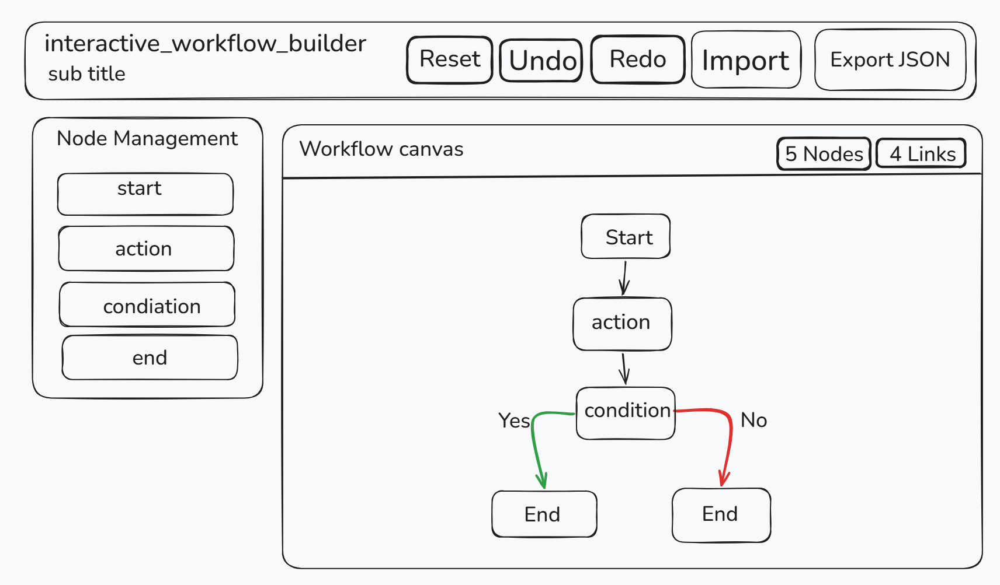

# Interactive Workflow Builder

## Approach and Design Decisions

The project was built step by step so each feature could be added, checked, and adjusted before moving to the next one. The editor layout was planned first, then the canvas was connected to React Flow, and after that the workflow behavior was added in layers such as dragging, connecting, validation, editing, JSON handling, and centralized state.

The screen layout was designed in Excalidraw before implementation. The final structure follows that direction, with a left-side node library and a larger workflow workspace in the center so the graph area remains the main focus of the screen.

Some key decisions taken during development:

- React Flow was used as the graph engine because it already handles node-based interactions well.
- The workflow is represented through `nodes` and `edges` so the data stays easy to understand and easy to save/load.
- Custom workflow nodes were used to represent `Start`, `Action`, `Condition`, and `End` clearly.
- Condition branching was handled through dedicated `yes` and `no` output handles.
- Node editing was moved into a popup flow instead of keeping a fixed side panel open all the time.
- JSON import/export was added through a modal flow to keep the main editor clean.

## State Management Strategy

The project currently uses two levels of state management.

Zustand is used for workflow graph state:

- `nodes`
- `edges`
- node creation
- edge creation
- node updates
- delete cleanup
- workflow snapshot loading

This keeps graph-related logic in one place instead of spreading it across multiple UI components.

Local React state is still used for short-lived UI interactions such as:

- popup visibility
- edit form values
- JSON modal state
- JSON import error messages

This split keeps the graph logic centralized while keeping temporary UI state simple.

## Challenges Encountered

- Making the editor grow in clear phases without overcomplicating early steps took careful planning.
- React Flow handles graph interaction well, but workflow-specific rules such as valid connections still had to be defined manually.
- Import/export required cleaning node data so UI-only values were not stored in the workflow JSON.
- Once more features were added, the shell component started carrying too much graph logic, which is why moving graph state into Zustand became necessary.
- Sidebar drag-and-drop needed adjustment because using a button itself as the drag source was not reliable enough.

## Potential Improvements

- add undo / redo functionality
- add a mini-map or overview panel
- add keyboard shortcuts for common actions
- improve connection validation with stricter workflow rules if needed
- improve automatic node placement for newly added nodes
- improve the JSON import/export experience further
- add more UI polish and consistency across the editor
- add tests for workflow validation and persistence logic
